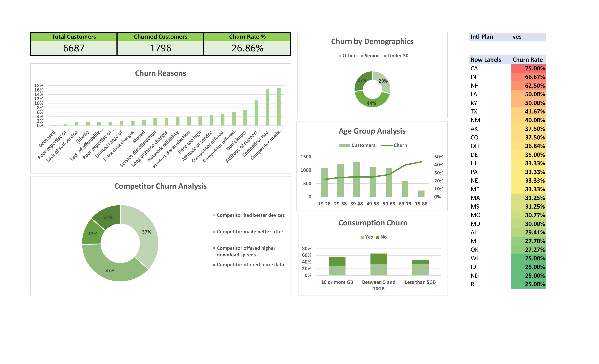

# Customer Churn Analysis — Excel Dashboard


**A dashboard that tells a telecom which customers are leaving — and why.**

When a customer cancels, the company loses recurring revenue and has to spend more winning a replacement than it would have spent keeping them. This dashboard takes data on 6,687 telecom customers, works out how many are leaving, who they are, and what's driving them out — all in plain Excel.

Out of 6,687 customers, **1,796 left — a 26.9% churn rate.**

---

## The dashboard

Total customers, how many churned, and the headline churn rate sit on KPI cards up top, with the segment breakdowns — age, demographics, churn reasons, competitor pull, and data usage — laid out below.



---

## What the data revealed

- **Seniors leave the most** — about 38% churn, against 23% for under-30s.
- **Age is a steady driver** — churn rises with every age band, hitting ~40% at 69–78 and ~44% at 79–88.
- **Competitors are the single biggest reason** — better devices and better offers account for most competitor-driven churn (~37% each).
- **Support experience matters** — "attitude of support staff" alone explains around 11% of churn, and it's fixable.

---

## What the business should do about it

1. **Aim retention offers at older customers**, who leave at 38–44% — well above the 27% average.
2. **Build counter-offers against competitors**, since device and price deals are pulling customers away.
3. **Look hard at support quality**, because a real slice of churn comes down to how customers were treated.

---

## Open it yourself

1. Download the workbook from the `reports/` folder.
2. Open it in Excel (2016 or later).
3. The **DASHBOARD** sheet is the main view — the other tabs hold the pivot tables behind it.

<details>
<summary>Repository structure</summary>

```
customer-churn-analysis-excel/
├── README.md
├── LICENSE
├── data/        raw dataset + data dictionary
├── reports/     the Excel dashboard workbook
└── assets/      dashboard screenshot
```
</details>

---

Made by **Nikhil Chandrakar** · [LinkedIn](https://linkedin.com/in/nikchansocial) · [GitHub](https://github.com/nikchansocial)
